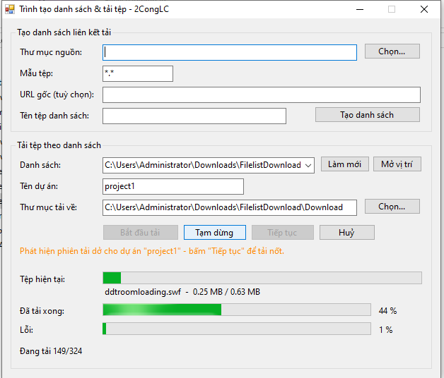

# Trình tạo danh sách & tải tệp — 2CongLC

<p align="center">
  
</p>


Công cụ WinForms (VB.NET) gồm 2 chức năng:

1. **Tạo danh sách liên kết tải** — quét một thư mục tệp trên máy, sinh ra danh sách URL (hoặc đường dẫn) tương ứng, lưu ra tệp `.txt`.
2. **Tải hàng loạt tệp theo danh sách** — đọc lại tệp `.txt` đó và tải toàn bộ tệp về máy, có tiến độ theo từng tệp và tổng thể, hỗ trợ **Tạm dừng / Tiếp tục** — kể cả sau khi đóng chương trình.

Build bằng `vbc.exe` có sẵn trong .NET Framework, **không cần Visual Studio**.

---

## Tính năng

- Quét thư mục nguồn theo mẫu tệp (`*.png`, `*.zip`, `*.*`...), giữ nguyên cấu trúc thư mục con khi sinh URL.
- Danh sách được lưu trong thư mục `data\`, có thể chọn lại nhiều lần.
- Tải tuần tự từng tệp (không bắn hàng loạt kết nối cùng lúc), tránh nghẽn băng thông.
- **Tải tiếp từ chỗ dở dang** bằng HTTP Range request — nếu server hỗ trợ, tệp đang tải dở sẽ được nối tiếp thay vì tải lại từ đầu.
- **Tạm dừng / Tiếp tục thật sự**: khi bấm Tạm dừng, tiến độ hàng đợi được lưu vào `temp\{tên_dự_án}-queue.txt`. Đóng chương trình rồi mở lại, chỉ cần gõ đúng Tên dự án là thấy gợi ý tiếp tục.
- **Huỷ**: xoá hẳn phiên tải, khác với Tạm dừng (không giữ lại để tiếp tục).
- Theo dõi riêng: thanh tiến độ tệp hiện tại, số tệp đã xong, số tệp lỗi.

---

## Cấu trúc project

| Tệp                     | Vai trò |
|--------------------------|---------|
| `Program.vb`              | Entry point (`Sub Main`), khởi chạy `Form1`. |
| `Form1.vb`                | Giao diện (dựng hoàn toàn bằng code, không cần `Form1.Designer.vb`) + điều phối. |
| `FileDownloadData.vb`     | Mô tả một URL: tự bóc tách đường dẫn tương đối để tái tạo cấu trúc thư mục khi lưu. |
| `FileListBuilder.vb`      | Quét thư mục nguồn, sinh danh sách URL, lưu ra `data\*.txt`. |
| `DownloadManager.vb`      | Tải tuần tự bằng `HttpWebRequest` + `Range`, chạy nền trên 1 `Thread`, hỗ trợ Tạm dừng/Tiếp tục/Huỷ. |
| `DownloadQueueState.vb`   | Lưu & khôi phục trạng thái hàng đợi ra `temp\*.txt` để tiếp tục sau khi tắt chương trình. |
| `build.bat`               | Script build bằng `vbc.exe`, không cần Visual Studio. |

Thư mục sinh ra khi chạy:

```
data\              danh sách URL đã tạo (*.txt)
temp\              trạng thái hàng đợi đang tạm dừng (*-queue.txt), tự xoá khi tải xong/huỷ
Download\{project}\ tệp đã tải về, giữ nguyên cấu trúc thư mục con
```

---

## Build

Yêu cầu máy đã cài .NET Framework 4.x (không cần Visual Studio).

1. Copy toàn bộ các tệp `.vb` và `build.bat` vào cùng một thư mục.
2. Chạy `build.bat`.
3. Script tự dò `vbc.exe` trong `%WINDIR%\Microsoft.NET\Framework\v4.0.x` (rồi `Framework64` nếu không thấy), build ra `FileListDownloader.exe` ngay trong thư mục đó.

> Lưu ý: một số máy chỉ có `vbc.exe` gốc của .NET Framework 4.0 (chưa vá lên 4.5), thiếu vài cú pháp VB đời mới (auto-property `ReadOnly` gán trong constructor...). Code trong project này đã viết theo lối tương thích ngược để build được trên cả các máy đó.

---

## Cách dùng

### 1. Tạo danh sách liên kết tải
- **Thư mục nguồn**: chọn thư mục chứa tệp cần liệt kê.
- **Mẫu tệp**: ví dụ `*.png`, `*.zip`, hoặc `*.*` cho tất cả.
- **URL gốc** (tuỳ chọn): nếu điền, danh sách sẽ là URL đầy đủ (`http://host/...`); để trống thì danh sách là đường dẫn tuyệt đối trên máy.
- **Tên tệp danh sách**: tên tệp `.txt` lưu trong `data\` (để trống sẽ tự đặt tên theo thời gian).
- Bấm **Tạo danh sách**.

### 2. Tải tệp theo danh sách
- **Danh sách**: chọn tệp `.txt` vừa tạo (hoặc **Làm mới** nếu không thấy).
- **Tên dự án**: dùng để đặt tên thư mục lưu tệp (`Download\{tên_dự_án}\`) và tệp trạng thái tạm dừng.
- **Thư mục tải về**: nơi lưu tệp, mặc định là `Download\` cạnh chương trình.
- Bấm **Bắt đầu tải**.
- Trong lúc tải:
  - **Tạm dừng** — dừng đúng tại vị trí đang tải, lưu tiến độ lại.
  - **Tiếp tục** — tải nốt phần còn thiếu (khớp lại theo Tên dự án).
  - **Huỷ** — bỏ hẳn phiên tải, xoá luôn tiến độ đã lưu.

Nếu đóng chương trình khi đang tạm dừng, lần sau mở lại chỉ cần gõ đúng **Tên dự án** cũ, chương trình sẽ tự nhận ra và gợi ý bấm **Tiếp tục**.

---

## Ghi chú

- Nếu server không hỗ trợ Range request, tệp đang tải dở sẽ được tải lại từ đầu (tự động, không cần can thiệp).
- Với tệp trên 2 GB, tính năng tiếp tục theo Range có thể không áp dụng được do giới hạn của `HttpWebRequest.AddRange` — trường hợp đó tệp sẽ được tải lại từ đầu khi Tiếp tục.
